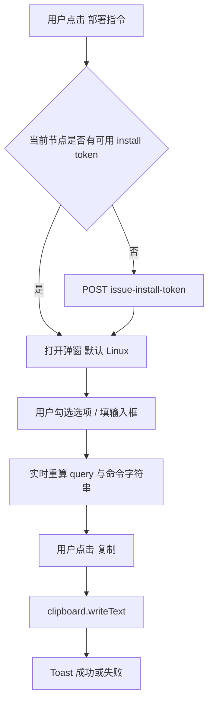
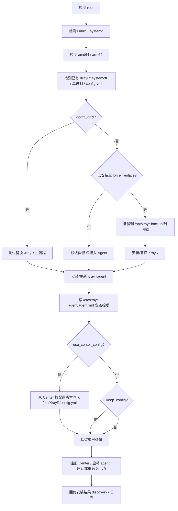

# XrayR Center 节点一键部署：前后端与流程设计

> 文档性质：设计与流程说明，**不替代源码**；实现时以仓库内实际路由与 handler 为准。  
> 视觉参考：工作区已保存的示意图见文末「附录：视觉参考图路径」。

---

## 1. 产品目标

在节点创建后，管理员通过 **「一键部署指令」** 弹窗选择 Linux 安装选项、复制一条可在目标 VPS 上执行的命令，完成 Agent（及可选的 XrayR）安装与注册，使节点进入可监控、可管控状态。

```text
创建节点 → 签发安装令牌 → 打开弹窗选参 → 生成命令 → VPS root 执行
    → 脚本检测环境 / 已有 XrayR → 按策略安装或接入 → Agent 注册 → Center 在线
```

---

## 2. 与当前代码基线的差异（设计落地前必读）

| 能力 | 当前实现（摘要） | 目标设计（本需求） |
|------|------------------|-------------------|
| 安装脚本 URL | `GET /api/admin/nodes/{id}/install-script.sh?register_token=...`（需管理 JWT 同会话或浏览器已登录场景与 Komari「公开一键链」不同） | 可增加 `GET /api/public/install-node.sh?token=...&os=linux&...`，便于无 Cookie 的纯 curl |
| Query 参数名 | `register_token` | 白名单内与前端一致；若保留旧路由需兼容映射 |
| 脚本内容 | 固定模板：校验 token、下载 Agent、写 `agent.yml`、systemd；**未**参数化 XrayR 替换/监控项等 | 按白名单 query 生成安全脚本分支 |
| Token 生命周期 | 注册成功后 `used_at` 置位，脚本再次拉取会 403 | 弹窗内：无 token 时先 `POST issue-install-token`；命令内携带 token，**不在页面单独明文展示区常驻** |

实现阶段可：**Phase 1** 先做弹窗 + 基于 `location.origin` 拼命令（可先指向现有 `install-script.sh` 或并行新增 public 路由）；**Phase 2** 再统一 public 脚本与校验。

---

## 3. 前端页面与组件结构

### 3.1 信息架构（与示意图对齐）

- **仪表盘**：统计卡片 + 节点卡片网格（可选）。
- **节点管理（表格）**：搜索、批量操作、表格列含 **操作区**。
- **操作区**：含 **部署指令 / 一键部署**（示意图中为终端类图标），与编辑、删除等并列。

参考布局（ASCII，与 Komari 风格一致）：

```text
┌────────────────────────────────────────────────────────────────────────────┐
│ XrayR Center                                          用户 / 退出          │
├────────────┬───────────────────────────────────────────────────────────────┤
│ 仪表盘     │ 节点管理                                    + 创建节点  …      │
│ 节点管理   │ ┌ 搜索 … ┌─────────────────────────────────────────────────┐ │
│ …         │ │ 表格：名称 │ IP │ Agent │ XrayR │ 区域 │ 状态 │ 操作        │ │
│           │ │ …        │ …  │ …     │ …     │ …   │ 在线 │ ▶ ✎ 📋 🗑   │ │
│           │ └─────────────────────────────────────────────────────────────┘ │
└────────────┴───────────────────────────────────────────────────────────────┘
```

### 3.2 「一键部署指令」弹窗（居中大卡）

- **宽度**：约 900–1000px，最大宽度 `min(960px, 92vw)`，与现有暗色玻璃风格一致。
- **标题**：一键部署指令。
- **系统 Tab（分段按钮）**：
  - **Linux**：默认选中，可用。
  - **Windows / macOS**：可见但 `disabled`，副文案「暂未支持」。
- **安装选项区**：双列 Grid，勾选后显示关联输入框（见第 4 节）。
- **命令预览区**：等宽字体、浅色半透明背景、自动换行。
- **主按钮**：「复制」宽度 100%，主色（如 `#6366F1` 系，与现有主题变量对齐）。
- **说明区**：提示使用 **root**、systemd、脚本行为摘要。

视觉稿对应关系：工作区 PNG 中「部署弹窗」区块（Linux 选中、Windows/macOS 禁用、双列选项、底部大复制按钮）。

---

## 4. 安装选项与 URL 参数映射

前端仅对「用户启用」的项追加 query；所有值经 `encodeURIComponent`。

| UI 选项 | Query 键 | 类型 / 默认 | 条件显示输入框 |
|---------|-----------|-------------|----------------|
| 禁用远程控制 | `disable_remote_control` | bool | 否 |
| 禁用自动更新 | `disable_auto_update` | bool | 否 |
| 忽略 TLS 证书校验 | `insecure_tls` | bool | 否 |
| 使用 GitHub 代理 | `github_proxy` | string | 勾选后 |
| 指定安装目录 | `install_dir` | 默认 `/opt/xrayr` | 勾选后 |
| 指定服务名称 | `service_name` | 默认 `XrayR` | 勾选后 |
| 只安装 Agent，不替换 XrayR | `agent_only` | bool | 否 |
| 强制替换已有 XrayR | `force_replace_xrayr` | bool | 否 |
| 保留现有 config.yml | `keep_config` | bool | 否 |
| 使用 Center 下发配置 | `use_center_config` | bool | 否 |
| 启用详细日志 | `verbose` | bool | 否 |
| 只监控指定网卡 | `include_nics` | string | 勾选后 |
| 排除指定网卡 | `exclude_nics` | 默认 `lo,docker0,br-` | 勾选后 |
| 只监控指定挂载点 | `mount_points` | 默认 `/` | 勾选后 |
| 采集间隔秒数 | `interval` | 默认 `10` | 勾选后（或始终显示数字框由产品定；需求描述为勾选后出现则遵循） |

**命令基础形态（目标）**：

```text
curl -fsSL "${location.origin}/api/public/install-node.sh?token=...&os=linux&..." -o install-xrayr-node.sh && bash install-xrayr-node.sh
```

- `CENTER_HOST` = `location.origin`（无尾部逻辑拼接路径）。
- `INSTALL_TOKEN` = 当前节点安装令牌；若节点详情无可用 token，先调用 **`POST /api/admin/nodes/{id}/issue-install-token`**，取回 `token` 仅用于填入命令，**不在弹窗其它区域长期明文展示**。
- `insecure_tls=true` 时：用户侧 **curl 增加 `-k`**（仅影响下载脚本那一步）；服务端脚本内对自签 Center 的 curl 行为需与需求一致且**不得**将任意用户输入拼进其它 shell 片段。

**复制**：`navigator.clipboard.writeText(fullCommand)`，成功 Toast；失败可降级提示。

---

## 5. 前端交互流程



**状态**：

- `modalOpen`, `selectedOS`（`linux` | `windows` | `macos`，非 linux 仅展示禁用态）
- `options`（各 bool / string / number）
- `installToken`（内存态，关闭弹窗可清空）、`tokenLoading`, `tokenError`

---

## 6. 后端接口设计

### 6.1 签发安装令牌（已存在）

- `POST /api/admin/nodes/{id}/issue-install-token`
- 响应含 `token`、`expires_at`（字段名以实际 API 为准）。

### 6.2 获取安装脚本（现状 vs 目标）

| 路由 | 说明 |
|------|------|
| 现状 | `GET /api/admin/nodes/{id}/install-script.sh?register_token=...` |
| 目标（建议新增） | `GET /api/public/install-node.sh?token=...&os=linux&...` |

**Public 脚本 handler 要求**：

1. **白名单**：仅处理文档「第 4 节表 + `token` + `os`」所列键；其余 **忽略或 400**（产品二选一，建议未知键 400 更易审计）。
2. **禁止**将任意 query 原样拼进 `eval`、反引号、`$(...)` 或 `bash -c "$VAR"` 形式的用户可控段。
3. **校验规则**（与需求一致）：
   - `install_dir`：绝对路径；禁止 `; & | \` $ < >` 等危险字符（可扩展黑名单）。
   - `service_name`：`^[A-Za-z0-9_.-]+$`。
   - `interval`：整数 5–300。
   - `include_nics` / `exclude_nics`：允许字符集 `A-Za-z0-9_.,-`。
   - `mount_points`：逗号分隔绝对路径列表，每段同上路径安全校验。
   - `github_proxy`：仅作 **下载 URL 前缀**（拼接 Agent/制品 URL 时校验 scheme/host，禁止换行与控制字符）。
   - `os`：第一阶段仅 `linux`；`windows`/`macos` 返回 **501 或 400 + 明确文案「暂未支持」**（与前端禁用 Tab 一致）。
4. **Token**：校验存在、未过期、未使用（若业务允许「仅查看脚本未执行」需单独产品决策；当前库表语义为注册后 used）。
5. **Content-Type**：`text/x-shellscript; charset=utf-8`。

---

## 7. 目标 VPS 脚本逻辑（流程图）

与架构示意图「部署流程 10 步」对齐，脚本内部建议阶段化函数，便于日志与回滚。



**已有 XrayR 检测**（与需求列举一致）：`systemctl status`、固定路径探测、`which` 等；结果可 JSON 上报 discovery。

**备份**：`/opt/xrayr-backup/YYYYMMDDHHmmss/`，含二进制、config、unit 等；备份失败应中止强制替换。

---

## 8. Center → Agent 指令白名单（与架构图一致）

允许：`STATUS_XRAYR`、`START_XRAYR`、`STOP_XRAYR`、`RESTART_XRAYR`、`INSTALL_XRAYR`、`UPGRADE_XRAYR`、`ROLLBACK_XRAYR`、`APPLY_CONFIG`、`TAIL_LOG`、`DISCOVER_XRAYR`、`CHECK_PORTS`（及现有 `PING`、`SYNC_STATUS` 等以保持兼容）。

**禁止**：任意用户传入 shell、`EXEC_SHELL`、WebSSH、远程终端、前端传 `command` 字符串由 Agent 执行。

---

## 9. 安全与合规摘要

| 项 | 要求 |
|----|------|
| Query | 白名单 + 强校验；危险字符拒绝并 **400** |
| Token | 短期、一次性（与注册逻辑一致） |
| 传输 | 生产环境 HTTPS；`insecure_tls` 仅缩小为 curl `-k` 语义 |
| Agent | 注册后 HMAC；最小权限用户运行 |
| 审计 | 管理操作写 `operation_log`（签发 token、改节点策略等） |

---

## 10. 分阶段实施建议

| 阶段 | 内容 |
|------|------|
| Phase 1 | 弹窗 UI + 选项状态 + 命令实时生成 + 复制 + Toast；`issue-install-token` 兜底；可先拼 **现有** admin 脚本 URL 或占位 public URL |
| Phase 2 | `install-node.sh` public handler、参数校验、脚本模板参数化 |
| Phase 3 | VPS 侧完整闭环：检测/备份/替换策略/Center 配置拉取/回传 |
| Phase 4 | Center 控制与日志闭环精修 |
| Phase 5 | Dashboard 卡片网格、表格主题与 Komari 级视觉统一 |

---

## 11. 验证清单（与设计对应）

1. `node --check xrayr-center/internal/httpapi/static/app.js` 通过。  
2. `go test ./xrayr-center/...` 通过。  
3. `docker compose up -d --build` 后 Center 可访问。  
4. 创建节点后可打开弹窗；Linux 默认；Win/mac 禁用。  
5. 勾选选项命令变化；复制完整；危险参数 400；VPS 执行后可注册（与 token 策略一致）。

---

## 12. 需修改文件清单（实现阶段，非本文档操作）

- `xrayr-center/internal/httpapi/static/app.js`  
- `xrayr-center/internal/httpapi/static/style.css`  
- `xrayr-center/internal/httpapi/handlers_rest.go`  
- 若新增 public 路由：`xrayr-center/internal/httpapi/server.go`  
- 结果记录（可选）：`XRAYR_CENTER_NODE_INSTALL_SCRIPT_MODAL_RESULT.md`

---

## 附录：视觉参考图路径

用户提供的 UI / 架构示意图由 Cursor 保存在会话附件目录（**不一定**在 `E:\xrayr-project` 仓库根下；若需纳入版本库可复制到例如 `docs/assets/`）。本机典型绝对路径示例：

1. `C:\Users\siqn2\.cursor\projects\e-xrayr-project\assets\c__Users_siqn2_AppData_Roaming_Cursor_User_workspaceStorage_f3903d2212ddc96f1fa2ec9866373fde_images_image-09871a5f-c15e-44e5-9d32-121666b97fd6.png` — 仪表盘 / 节点表格 / **一键部署指令弹窗** UI。  
2. `C:\Users\siqn2\.cursor\projects\e-xrayr-project\assets\c__Users_siqn2_AppData_Roaming_Cursor_User_workspaceStorage_f3903d2212ddc96f1fa2ec9866373fde_images_image-6c88e4f9-d07a-467b-86f4-f456cd777cef.png` — **Center 后端架构与部署流程**（服务划分、10 步部署、指令白名单、安全摘要）。

---

*文档版本：与需求「一键部署指令」对齐；若路由或 token 字段与实现不一致，以合并时的 API 文档为准。*
